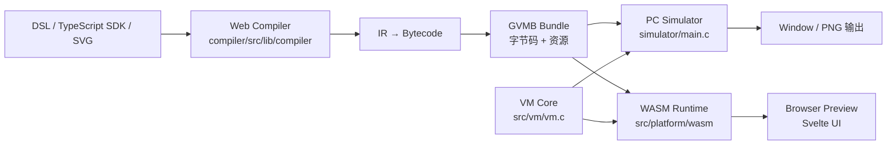
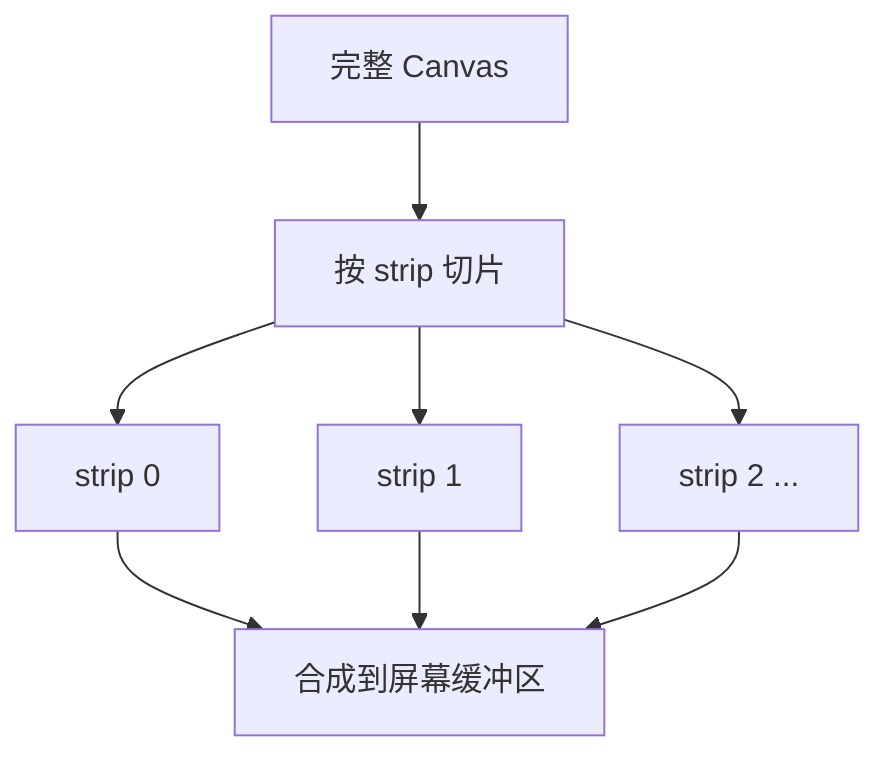
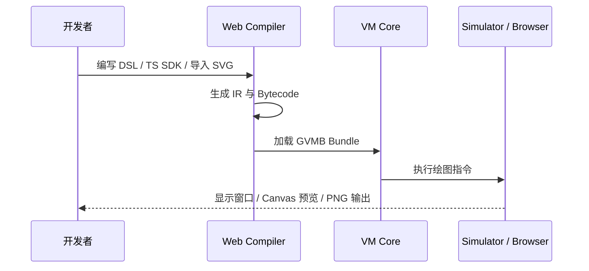

# GraphVM

<div align="center">


**一个面向低资源设备的 2D 图形虚拟机**  
C 核心 + PC 模拟器 + WASM 运行时 + Web 编译器，适合 **E-Ink / 仪表盘 / 小屏设备 UI** 场景。

</div>

---

## ✨ 项目简介

`GraphVM` 是一个围绕 **逻辑 Canvas** 构建的轻量级图形虚拟机项目，核心特点是：

- 使用 **C 语言** 实现栈式虚拟机与渲染核心
- 针对 MCU 内存限制采用 **strip 分片渲染**
- 提供 **PC 模拟器**，可直接输出窗口或 PNG
- 提供 **WASM 版本**，可在浏览器中实时预览
- 提供 **SvelteKit + TypeScript 编译器**，支持：
  - DSL 文本编译
  - TypeScript SDK 生成图形程序
  - SVG → bytecode 转换
- 支持 `rgb` / `bw` / `bwr`（黑白红）显示模式
- 支持 **FFI、事件绑定、局部刷新、定时更新**

> 从代码结构看，它已经不仅是一个 VM Demo，而是一套完整的“**图形脚本 → 字节码 → 多端运行**”验证平台。

---

## 🖼️ 系统架构图



### 低内存渲染思路



这种设计非常适合 **RAM 很小但仍需绘制 UI** 的嵌入式设备。

---

## 🚀 核心能力

### 1. 栈式图形虚拟机

VM 核心位于 `src/vm/`，包含：

- 数据栈 `stack[256]`
- 局部变量 `locals[32]`
- 调用栈 `call_stack[16]`
- 2D 变换矩阵栈
- 图形绘制状态（颜色、线宽、文本、路径）
- FFI 表和字体资源访问

支持的指令覆盖：

- **基础运算**：`PUSH_I32`、`ADD`、`SUB`、`MUL`、`DIV`
- **控制流**：`JMP`、`CALL`、`RET`
- **绘图**：`SET_COLOR`、`RECT_FILL`、`LINE`、`RECT`、`CIRCLE`、`TEXT`
- **扩展能力**：`CALL_FFI`、路径绘制、事件回调

### 2. 多运行目标

| 目标 | 位置 | 作用 |
|---|---|---|
| 原生 PC 模拟器 | `simulator/` | 调试 `.gvmb`、热重载、窗口显示、导出 PNG |
| 浏览器 WASM 运行时 | `src/platform/wasm/` | 给 Web 编译器提供实时预览 |
| Web 编译器 UI | `compiler/` | 编辑 DSL / SDK，查看 IR、Hex、资源和预览 |

### 3. 事件与局部刷新

从 `sdkSpec.md` 和 `simulator/main.c` 可见，项目已经支持：

- `TICK_SEC` / `TICK_DAY` 事件
- 通过 `ffi_bind_event` 绑定字节码入口
- 子函数只刷新局部区域
- 更适合 **时钟、天气卡片、待办面板、价签** 这类应用

---

## 📦 项目结构

```text
GraphVM/
├── src/
│   ├── vm/                # VM 核心、字节码解释器、字体与绘图逻辑
│   └── platform/          # PC / WASM 平台适配层、FFI 与设备上下文
├── simulator/             # 原生模拟器，可开窗口或导出 PNG
├── compiler/              # SvelteKit Web 编译器与在线预览器
├── scripts/               # WASM 构建脚本
├── doc/                   # 架构、字节码、SDK 规范文档
├── test/                  # 测试输入与 bundle 示例
└── build/                 # 已生成的构建输出
```

---

## 🔄 工作流程



---

## 🧪 项目里已有的示例

`compiler/static/examples/` 下已经准备了不少示例程序：

| 示例文件 | 类型 | 说明 |
|---|---|---|
| `hello_world.dsl` | DSL | 第一个欢迎界面示例 |
| `bw_dashboard.dsl` | DSL | 黑白仪表盘布局 |
| `bwr_price_tag.dsl` | DSL | 黑白红价签样式 |
| `sdk_bwr_weather.ts` | SDK | 墨水屏天气卡片 |
| `sdk_timer_demo.ts` | SDK | 定时刷新 / 事件驱动演示 |
| `sdk_bwr_todolist.ts` | SDK | 待办事项卡片 |

这说明项目已经具备从“底层 VM”到“上层应用模板”的完整闭环。

---

## ⚡ 快速开始

### 1) 构建原生模拟器

```powershell
cmake --preset default
cmake --build build --config Debug
```

### 2) 运行示例 bundle

```powershell
.\build\bin\Debug\graphvm_sim.exe test\graphvm.gvmb
```

如果想直接导出图片：

```powershell
.\build\bin\Debug\graphvm_sim.exe -out output test\graphvm.gvmb
```

### 3) 启动 Web 编译器

```powershell
cd compiler
npm install
npm run dev
```

或使用 Bun：

```powershell
cd compiler
bun install
bun run dev
```

### 4) 构建 WASM 运行时

```powershell
cmake --build build --config Debug --target graphvm_wasm
```

或执行脚本：

```powershell
.\scripts\build_wasm.ps1
```

### 5) 运行渲染测试

```powershell
cd compiler
bun run test:render
```

---

## ✍️ 示例：DSL 方式

下面这段示例就来自项目中的 `hello_world.dsl`：

```dsl
SET_COLOR 20 10 40
RECT_FILL 0 0 400 300

SET_COLOR 255 255 255
TEXT 110.0 148.0 "Hello, World!"

SET_COLOR 80 200 160
RECT_FILL 0 296 400 4
END
```

它会：

1. 绘制背景
2. 在画布上输出文字
3. 加一条底部装饰条

---

## ✍️ 示例：TypeScript SDK 方式

项目中的 `sdk_demo.ts` 体现了更强的编程式绘图能力：

```ts
const p = gvm();

p.setWindow(0, 0, 400, 300, 40, 40, 40);
p.setColor(255, 100, 50);
p.circleFill(200, 150, 40);

p.setColor(255, 255, 0);
p.forLoop('i', 0, 10, (loadI) => {
  loadI();
  p.pushI32(30).mul().pushI32(20).add().storeLocal('x');
  loadI();
  p.pushI32(25).mul().pushI32(15).add().storeLocal('y');
  p.loadLocal('x').loadLocal('y')
    .pushI32(25).pushI32(20)
    .emit({ op: 'rect_fill' });
});

return p;
```

适合用来生成：

- 仪表盘
- 图表与卡片布局
- 定时变化界面
- E-Ink 局部刷新的动态组件

---

## 🎯 适用场景

GraphVM 很适合以下方向：

- **电子纸 UI / 黑白红墨水屏**
- **嵌入式状态面板**
- **低功耗天气 / 日历 / 待办卡片**
- **图形脚本引擎验证**
- **SVG 到嵌入式显示的轻量转换链路**

---

## 📚 文档入口

如果你想继续深入，建议阅读：

- `doc/architecture.md` —— 整体架构
- `doc/bytecodeSpec.md` —— 字节码说明
- `doc/sdkSpec.md` —— TypeScript SDK 规范
- `doc/mcu_resource_assessment.md` —— MCU 资源评估

---

## ✅ 当前项目亮点总结

从现有代码看，这个仓库已经具备了一个很清晰的技术验证方向：

- **底层**：C 实现的图形 VM 足够轻量
- **中层**：bundle / FFI / 事件机制完整
- **上层**：Web 编译器 + 示例应用已经跑通
- **验证**：`render_test/` 提供了像素级渲染测试

这让 `GraphVM` 非常适合作为一个 **嵌入式图形运行时原型平台** 持续演进。

---

## License

See `LICENSE`.
